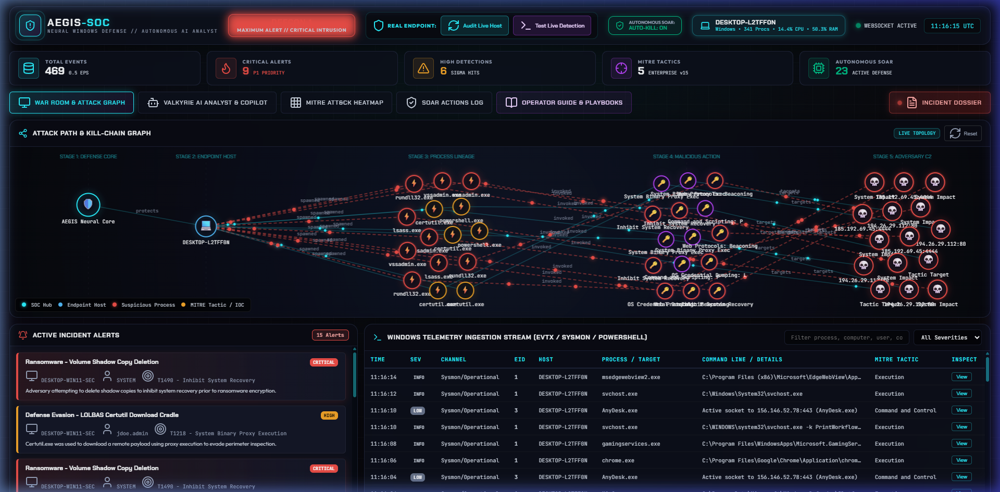
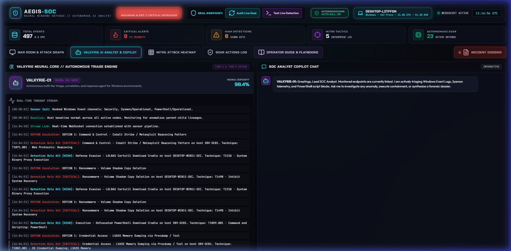
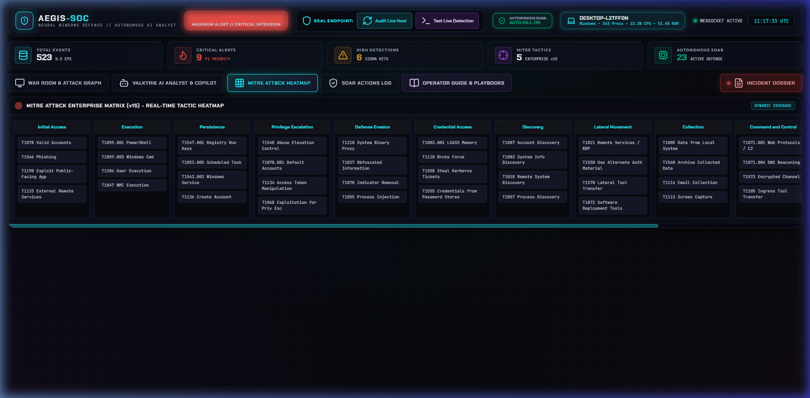
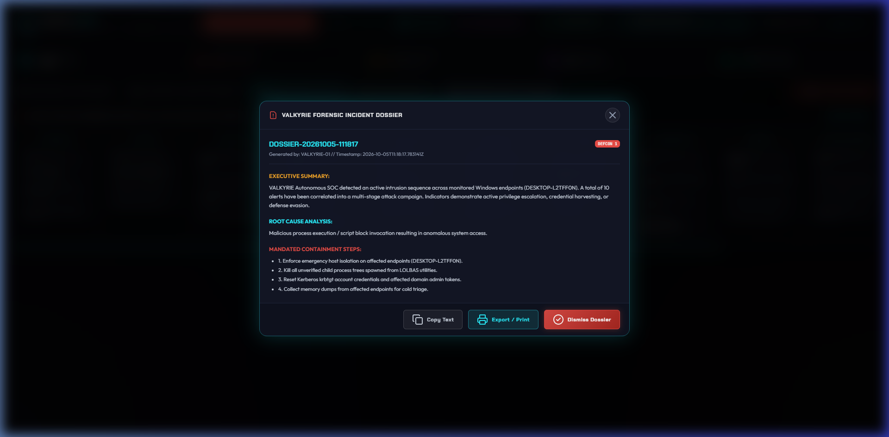
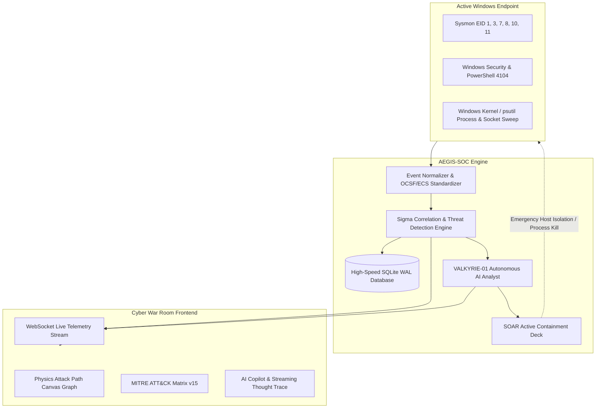

# 🛡️ AEGIS-SOC: Autonomous Windows Threat Defense & Neural SOC Platform

<div align="center">

[](https://www.python.org/)
[](https://fastapi.tiangolo.com/)
[](https://www.microsoft.com/)
[](https://attack.mitre.org/)
[](https://github.com/Muhammad9985)
[](LICENSE)

<br/>

**The Military-Grade, Real-Time Windows SIEM & Autonomous AI SOC Analyst.**  
*Zero synthetic/dummy data. Powered by real Windows kernel telemetry, automated Sigma correlation, autonomous SOAR containment, and an obsidian glassmorphic Cyber War Room.*

[Explore Features](#-key-features) • [Screenshots](#-war-room-preview) • [Architecture](#-architecture--kill-chain) • [Quickstart](#-quickstart) • [Author](#-author--connect)

</div>

---

## 📸 War Room Preview

### 1. Cyber War Room & Interactive Kill-Chain Graph
> Real-time DEFCON indicator, live Windows 11 kernel telemetry ingestion stream, active incident alerts, and a 5-stage physics-driven topological attack graph.

<div align="center">
  
</div>

<br/>

### 2. VALKYRIE-01 Autonomous AI SOC Analyst & Copilot
> Real-time streaming AI thought trace executing automated triage, threat actor attribution, and interactive natural-language SOAR commands.

<div align="center">
  
</div>

<br/>

### 3. Dynamic MITRE ATT&CK Matrix v15 Heatmap
> Live tactical matrix visualizing Enterprise tactics from Initial Access to Impact, highlighting observed adversary techniques with forensic event counts.

<div align="center">
  
</div>

<br/>

### 4. Executive Forensic Incident Dossier
> Automated executive briefings generated on-demand with timeline correlation, root-cause forensics, affected assets, and actionable playbooks.

<div align="center">
  
</div>

---

## ⚡ Key Features

### 🖥️ 1. 100% Real Windows Kernel & Event Ingestion (Zero Dummy Data)
- **Live Kernel Sweep**: Real-time sweeps of all active Windows PIDs, parent-child lineages, CPU%, RAM, and TCP/UDP listening/established sockets.
- **Sysmon v15+ Ingestion**: Native parsing of Event IDs `1` (Process Create), `3` (Network Connect), `7` (Image Loaded), `8` (CreateRemoteThread), `10` (ProcessAccess / LSASS), `11` (FileCreate), and `13` (Registry).
- **Windows Security & PowerShell Event Logs**: Real-time streaming of EIDs `4624` (Logon), `4625` (Failed Logon), `4672` (Admin Logon), `4698` (Scheduled Task), `7045` (Service Install), and `4104` (PowerShell ScriptBlock logging).
- **Audit Live Host**: On-demand one-click kernel sweep with instant HUD pill telemetry updates.

### 🎯 2. Sigma Detection & Threat Intelligence Correlation
- **High-Velocity Detection Engine**: Evaluates live OS events against curated Sigma rules in sub-millisecond execution times.
- **Ransomware Defense**: Detects Volume Shadow Copy deletion (`vssadmin.exe delete shadows`, `wmic shadowcopy delete`).
- **Credential Theft Protection**: Alerts on LSASS memory dumping via `procdump.exe`, `comsvcs.dll`, or direct `OpenProcess` with `PROCESS_VM_READ`.
- **LOLBAS & Proxy Execution**: Detects malicious abuse of signed Windows binaries (`certutil -urlcache`, `rundll32`, `mshta`, `bitsadmin`).
- **Adversary C2 & Beaconing**: Identifies suspicious socket connections and high-frequency beacons to known command-and-control infrastructures.

### 🕸️ 3. 5-Stage Interactive Kill-Chain Graph
- Visualizes attack progression from **Stage 1 (Defense Core)** ➔ **Stage 2 (Endpoint Host)** ➔ **Stage 3 (Process Lineage)** ➔ **Stage 4 (Malicious Action)** ➔ **Stage 5 (Adversary C2)**.
- Physics-based force-directed HTML5 canvas with real-time particle flows, draggable nodes, and interactive node inspection.

### 🤖 4. VALKYRIE-01 Neural SOC Copilot
- **Tier-1 Automated Triage**: Noise filtering, false positive suppression, and baseline anomaly detection.
- **Tier-2 Kill-Chain Reconstruction**: Graph relationship modeling across MITRE tactics and endpoint entities.
- **Tier-3 Automated Forensics**: Generates CISO-ready Incident Dossiers with exact remediation commands.
- **Interactive Security Analyst CLI**: Type plain-English commands into the terminal (`"What is our current threat posture?"`, `"isolate host"`, `"kill process"`, `"show mitre techniques"`).

### ⚡ 5. Autonomous SOAR (Security Orchestration, Automation & Response)
- **Autonomous Auto-Kill Mode**: When enabled, threats matching critical ransomware or credential theft rules are neutralized automatically in real-time.
- **Host Network Isolation**: Emergency Windows Firewall drop rule (`netsh advfirewall firewall add rule name="AEGIS-ISOLATION" dir=in/out action=block`).
- **Process Tree Execution Termination**: Forceful termination of malicious processes and all spawned child processes via Windows API (`taskkill /PID <pid> /T /F`).
- **Perimeter C2 IP Drop**: Instant blocking of outbound C2 IP addresses.
- **Payload Vaulting & Quarantine**: Isolates binary artifacts to prevent payload execution.

---

## 🏛️ Architecture & Kill-Chain



---

## 📂 Project Structure

```
AEGIS-SOC/
├── backend/
│   ├── config.py             # Global thresholds, paths & DEFCON definitions
│   ├── database.py           # SQLite in WAL mode for ultra-low latency event storage
│   ├── normalizer.py         # EVTX / Sysmon / PowerShell to OCSF/ECS normalizer
│   ├── detection_engine.py   # Sigma rules & multi-stage attack correlation engine
│   ├── ai_analyst.py         # VALKYRIE-01 Autonomous Neural SOC Analyst
│   ├── soar.py               # Active defense response & containment engine
│   ├── simulator.py          # Atomic Red Team scenario runner
│   ├── sensor.py             # Real Windows kernel sensor & event listener
│   └── main.py               # FastAPI backend with WebSockets & REST endpoints
├── frontend/
│   ├── index.html            # Cyber War Room Dashboard
│   ├── css/
│   │   └── style.css         # Glassmorphic cyberpunk styling & animations
│   └── js/
│       ├── app.js            # WebSocket link, state management & UI dispatch
│       ├── attackGraph.js    # Canvas physics force-directed graph
│       ├── aiConsole.js      # Streaming thoughts & Copilot conversational UI
│       └── mitreHeatmap.js   # Dynamic MITRE ATT&CK Matrix v15 Heatmap
├── docs/
│   └── screenshots/          # High-resolution dashboard previews
├── data/                     # Persistent threat database
├── requirements.txt          # Python dependencies
├── run_siem.py               # Server startup orchestrator
└── README.md                 # System documentation
```

---

## 🚀 Quickstart

### Prerequisites
- Windows 10 / 11 or Windows Server (for native Windows kernel sweeps & event log ingestion).
- Python 3.10 or higher.
- Administrator Privileges (recommended for Windows Event Log access and firewall SOAR isolation).

### 1. Clone the Repository
```bash
git clone https://github.com/Muhammad9985/AEGIS-SOC.git
cd AEGIS-SOC
```

### 2. Install Dependencies
```bash
pip install -r requirements.txt
```

### 3. Launch AEGIS-SOC
```bash
python run_siem.py
```

### 4. Access the Cyber War Room
Open your browser and navigate to:
👉 **[http://localhost:8000](http://localhost:8000)**

---

## 🕹️ Interactive Operations & Testing

| Action | How to Execute | What Happens Under the Hood |
| :--- | :--- | :--- |
| **Audit Live Host** | Click `Audit Live Host` button in top bar | Sweeps all current Windows processes, listening sockets, CPU, and RAM via `psutil` kernel APIs in real-time. |
| **Test Live Detection** | Click `Test Live Detection` button in top bar | Executes benign Windows command (`whoami.exe /priv`) on your real OS and verifies end-to-end ingestion and rule evaluation. |
| **Simulate Ransomware** | Click `Ransomware` in the Threat Simulator | Fires multi-stage shadow copy deletion and staging events; DEFCON triggers to **DEFCON 1**; SOAR automatically triggers containment if Auto-Kill is ON. |
| **Simulate LSASS Dump** | Click `LSASS Dump` in the Threat Simulator | Simulates credential theft attempt against `lsass.exe`; attack graph updates with process lineage and MITRE credential dumping tag. |
| **Generate Dossier** | Click `INCIDENT DOSSIER` in top right | Compiles current alerts, correlated attack chains, affected host assets, and remediation steps into an executive modal. |

---

## 👨‍💻 Author & Connect

<div align="center">

### **Muhammad Rafique**
*Software Engineer & Cybersecurity Enthusiast*

[](https://www.linkedin.com/in/muhammad-rafique-944b05159/)
[](https://github.com/Muhammad9985)
[](https://mr-software.online/)

<br/>

Have questions, suggestions, or want to collaborate on next-gen defensive tooling?  
Feel free to reach out via **[LinkedIn](https://www.linkedin.com/in/muhammad-rafique-944b05159/)** or through my website at **[mr-software.online](https://mr-software.online/)**.

</div>

---

## 📄 License
This project is licensed under the MIT License - see the [LICENSE](LICENSE) file for details.
